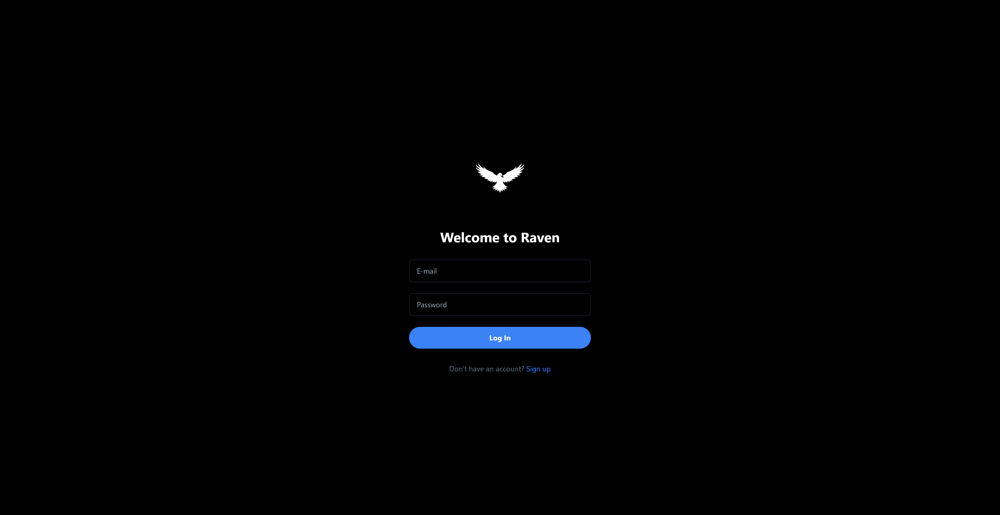

[PYTHON_BADGE]:https://img.shields.io/badge/python-3670A0?style=for-the-badge&logo=python&logoColor=ffdd54
[DJANGO_BADGE]:https://img.shields.io/badge/django-%23092E20.svg?style=for-the-badge&logo=django&logoColor=white
[DRF_BADGE]:https://img.shields.io/badge/DJANGO-REST-ff1709?style=for-the-badge&logo=django&logoColor=white&color=ff1709&labelColor=gray
[REACT_BADGE]:https://img.shields.io/badge/react-%2320232a.svg?style=for-the-badge&logo=react&logoColor=%2361DAFB
[JWT_BADGE]:https://img.shields.io/badge/JWT-black?style=for-the-badge&logo=jsonwebtokens
[PRS_BADGE]:https://img.shields.io/badge/PRs-welcome-green?style=for-the-badge

<h1 align="center" style="font-weight: bold;">Raven 🐦</h1>

![python][PYTHON_BADGE]
![django][DJANGO_BADGE]
![drf][DRF_BADGE]
![react][REACT_BADGE]
![jwt][JWT_BADGE]
![prs][PRS_BADGE]



<p align="center">
  <b>
    A Twitter-like social network built with Django REST Framework + JWT and a React frontend.
  </b>
</p>

---

<details open="open">
<summary>Table of Contents</summary>

- [🚀 Getting Started](#started)
- [📍 How It Works](#how-it-works)
- [⚙️ Technologies Used](#tech)
- [🤝 How to Reach Me](#reach)

</details>


<h2 id="how-it-works">📍 How It Works</h2>

Raven is a full stack social network inspired by Twitter, featuring authentication with JWT, personalized feeds, tweets, likes, comments, profiles, and follow systems.

---
<h2 id="tech">⚙️ Technologies</h2>

- Python
- Django
- Django REST Framework
- JWT
- React

---

<h2 id="started">🚀 Getting Started</h2>

## Step by step to running the application (Backend + Frontend)

This project has two main directories:

- `backend/` → API built in **Django** + **PostgreSQL**
- `frontend/` → App built in **React + Vite**

> **Obs:** on development environment, the frontend uses **Vite proxy** to forward requests to the API in `/api`.

---

### Summary

- [Project Structure](#project-structure)
- [Step 1: Running the Backend Locally](#step-1-running-the-backend-locally)
  - [1.1 Installing Dependencies](#11-installing-dependencies)
  - [1.2 Configure Virtual Environment](#12-configure-virtual-environment)
  - [1.3 Install Project Dependencies](#13-install-project-dependencies)
  - [1.4 Configure PostgreSQL Database](#14-configure-postgresql-database)
  - [1.5 Run Migrations](#15-run-migrations)
  - [1.6 Run Server](#16-run-server)
- [Step 2: Running the Backend with Docker](#step-2-running-the-backend-with-docker)
  - [2.1 Environmental Variables](#21-environmental-variables)
  - [2.2 Run Containers](#22-run-containers)
  - [2.3 Running Migrations on Docker](#23-running-migrations-on-docker)
  - [2.4 Access Application](#24-access-application)
  - [2.5 Stop Containers](#25-stop-containers)
- [Step 3: Running Frontend Locally](#step-3-running-frontend-locally)
  - [3.1 Prerequisites](#31-prerequisites)
  - [3.2 Install Frontend Dependencies](#32-install-frontend-dependencies)
  - [3.3 Proxy for API (already configured)](#33-proxy-for-api-already-configured)
  - [3.4 Running Frontend on Dev mode](#34-running-frontend-on-dev-mode)
  - [3.5 Build/Preview (optional)](#35-buildpreview-optional)
- [Running Backend + Frontend together (common scenarios)](#running-backend--frontend-together-common-scenarios)
- [Troubleshooting](#troubleshooting)

---

### Project Structure

```text
.
├── backend/
│   ├── manage.py
│   ├── docker-compose.yml (se aplicável)
│   ├── pyproject.toml
│   └── ...
└── frontend/
    ├── package.json
    ├── vite.config.ts
    └── ...
```

---

### Step 1: Running the Backend Locally

#### 1.1. Installing Dependencies

To run the backend locally (without Docker), you will need:

- **Python 3.13**
- **Poetry**
- **PostgreSQL**

##### Install Python

Make sure Python 3.13 is already installed.

- https://www.python.org/downloads/

##### Instalar PostgreSQL

Make sure PostgreSQL is already installed.

- https://www.postgresql.org/download/

##### Install Poetry

Poetry is a Python manager dependencies. Install it running:

```bash
curl -sSL https://install.python-poetry.org | python3 -
```

> Tip: After you install it, it might be necessary reopen the terminal for `poetry` to be able on PATH.

#### 1.2. Configure Virtual Environment

Create and active a virtual environment:

```bash
# Create virtual environment
python3 -m venv env

# Active virtual environment (Linux/Mac)
source env/bin/activate

# Active virtual environment (Windows)
env\Scripts\activate
```

#### 1.3. Install Project Dependencies

get in backend directory and install the dependencies with Poetry:

```bash
cd backend
poetry install
```

#### 1.4. Configure PostgreSQL Database

##### 1) Create database on Postgres

Example: Creating a datbase called `raven_db`:

```bash
psql -U postgres
CREATE DATABASE raven_db;
```

##### 2) Configure `.env.dev` file

Create an `env.dev` file in **backend** root directory (`backend/env.dev`) with the settings of the project.

You can fill it out by yourself, or use the example right bellow as a basis:

```ini
# backend/.env.dev

DEBUG=1
SECRET_KEY=changeme-in-dev
DJANGO_ALLOWED_HOSTS=localhost 127.0.0.1 [::1]

SQL_ENGINE=django.db.backends.postgresql
SQL_DATABASE=raven_db
SQL_USER=postgres
SQL_PASSWORD=postgres
SQL_HOST=localhost
SQL_PORT=5432
```

> Set `SQL_USER` / `SQL_PASSWORD` as your local PostgreSQL.

#### 1.5. Run Migrations

With the database configured, run migrations:

```bash
cd backend
poetry run python manage.py migrate
```

> If you are in the virtual environment, you may prefer run `python manage.py migrate` directly.

#### 1.6. Run Server

To run the application locally:

```bash
cd backend
poetry run python manage.py runserver
```

Now, the backend should be availiable on:

- http://127.0.0.1:8000

---

### Step 2: Running the Backend with Docker

> These steps assume that there is a `docker-compose.yml` (in the `backend/` directory, or at the root of the project) with services `web` and `db`.

#### 2.1. Environment Variables

Create `env.dev` file (if it doesn't exists), with the database environment variables.

For example:

```ini
# backend/env.dev (ou ./env.dev, dependendo do seu docker-compose)

DEBUG=1
SECRET_KEY=changeme-in-dev
DJANGO_ALLOWED_HOSTS=localhost 127.0.0.1 [::1]

SQL_ENGINE=django.db.backends.postgresql
SQL_DATABASE=raven_db
SQL_USER=postgres
SQL_PASSWORD=postgres
SQL_HOST=db
SQL_PORT=5432
```

> In Docker, the `SQL_HOST` is normally the name of the database service on compose (ex: `db`).

#### 2.2. Run Containers

On the folder where `docker-compose.yml` is located, execute:

```bash
docker-compose up --build
```

#### 2.3. Running Migrations on Docker

With the containers running on, make migrations within container `web`:

```bash
docker-compose exec web python manage.py migrate
```

#### 2.4. Access Application

Now, the backend will be availiable on:

- http://localhost:8000

#### 2.5. Stop Containers

For stop the containers:

```bash
docker-compose down
```

---

### Step 3: Running Frontend Locally

#### 3.1. Prerequisites

- **Node.js**
- **npm** (or `yarn`/`pnpm`)

#### 3.2. Install Frontend Dependencies

Get in `frontend` directory and install the dependencies:

```bash
cd frontend
npm install
```

#### 3.3. Proxy for API (already configured)

The `vite.config.ts` is configured to take calls for `/api` to backend on `http://127.0.0.1:8000`:

```ts
import { defineConfig } from 'vite';
import react from '@vitejs/plugin-react';

export default defineConfig({
  plugins: [react()],
  optimizeDeps: {
    exclude: ['lucide-react'],
  },
  server: {
    proxy: {
      '/api': 'http://127.0.0.1:8000',
    },
  },
});
```

✅ That allows that frontend make calls like that:

- `fetch('/api/users/token/')`

…and Vite redirect to:

- `http://127.0.0.1:8000/api/users/token/`

> If your backend is in another host/door, set it up on `vite.config.ts`.

#### 3.4. Running Frontend on Dev mode

```bash
cd frontend
npm run dev
```

By deafult, Vite runs in:

- http://localhost:5173

#### 3.5. Build/Preview (optional)

Generate build for production:

```bash
npm run build
```

View build locally:

```bash
npm run preview
```

---

### Running Backend + Frontend together (common scenarios)

#### Scenario A: local Backend + local Frontend

1) Run backend:

```bash
cd backend
poetry run python manage.py runserver
```

2) Run frontend:

```bash
cd frontend
npm run dev
```

- Backend: http://127.0.0.1:8000  
- Frontend: http://localhost:5173

#### Scenario B: Backend on Docker + local Frontend

1) Run backend by Docker:

```bash
# run on directory where docker-compose.yml is located
docker-compose up --build
```

2) Migrations:

```bash
docker-compose exec web python manage.py migrate
```

3) Run frontend locally:

```bash
cd frontend
npm install
npm run dev
```

---

### Troubleshooting

#### Frontend can not access `/api`

- Confirm that backend is running in `http://127.0.0.1:8000` (or set up proxy of Vite).
- Confirm that your API routes starts with `/api`.

#### Token/login

Token is stored on `localStorage` (`authToken`). if something gets “stuck”, try:

- Clear `localStorage` on browser
- Reload the page

---

#### Useful commands (Frontend)

```bash
npm run lint
npm run build
npm run preview
```

---

<h2 id="reach">🤝 How to reach me</h2>

<table>
  <tr>
    <td align="center">
      <a href="https://linktr.ee/monosodrac">
        <br>
        <sub>
          <b>Mono</b>
        </sub>
      </a>
    </td>
  </tr>
</table>
